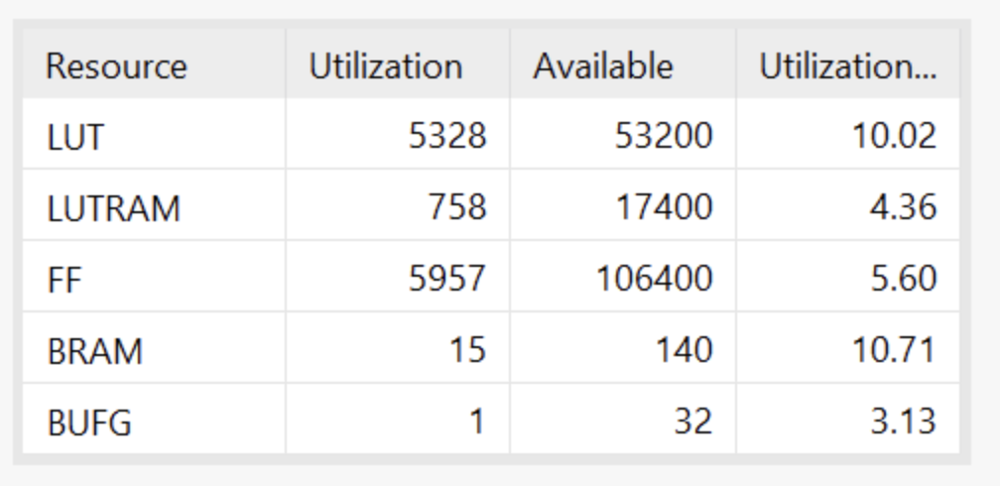
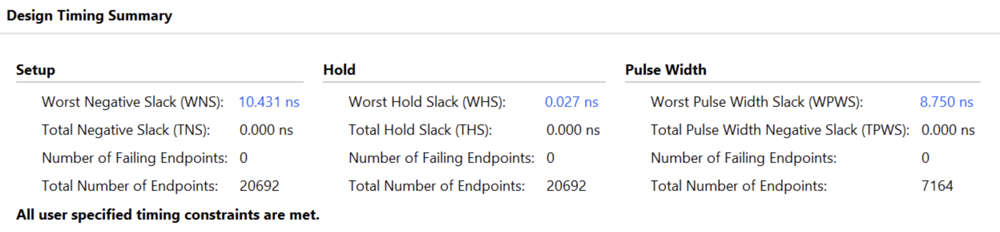
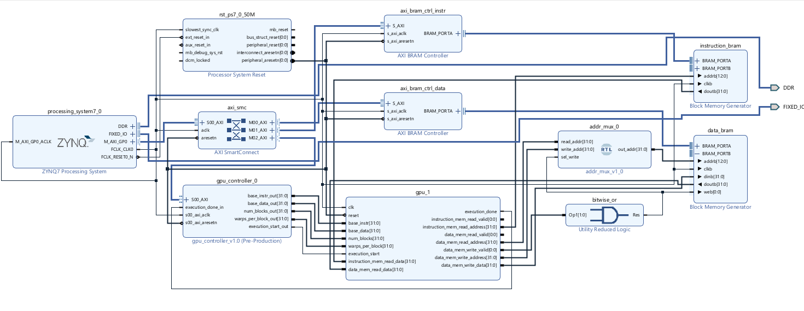

# FPGA K-Means Clustering Accelerator

  
  
  
  

## Project Overview

This repository documents the creation of a complete hardware/software co-design project featuring a custom 32-bit GPGPU and its C++ toolchain, specifically engineered to accelerate K-Means clustering on an FPGA. This project demonstrates a full-stack approach to custom computing, from designing a bespoke Instruction Set Architecture (ISA) to developing a compiler and deploying the final design on a Xilinx PYNQ-Z1 board.

## Core Components & Workflow

The system is built on a hardware/software co-design philosophy, partitioning tasks between the PYNQ's ARM Processing System (PS) and a custom accelerator on the Programmable Logic (PL).

1.  **Custom C Kernel:** The parallel part of the K-Means algorithm is written in a C-like syntax.
2.  **C++ Compiler:** An AST-based compiler parses the kernel, performs register allocation, and generates assembly code for the custom ISA.
3.  **C++ Assembler:** Converts the human-readable assembly into 32-bit machine code.
4.  **SystemVerilog GPGPU:** The machine code is loaded onto the custom-designed GPGPU core on the FPGA, which executes the massively parallel distance calculations.
5.  **ARM PS Control:** The ARM core manages the overall process, including data movement and the final centroid update calculations, which are not suitable for the parallel fabric.

## Key Architectural Features

*   **Custom SIMT Core:** A 16-lane GPGPU core designed in SystemVerilog, operating on the Single Instruction, Multiple Threads (SIMT) paradigm. A single instruction is fetched and decoded, then executed in parallel across all 16 thread lanes.
*   **Bespoke RISC-style ISA:** A custom 32-bit instruction set designed to be dense and efficient for GPGPU workloads. It includes vector integer, vector floating-point, and scalar control flow instructions.
    *   **[View the Full Elson-V ISA Specification here](./docs/ISA.md)**
*   **Resource-Efficient Pipelined Design:** The core features a 5-stage pipeline (Fetch, Decode, Register Read, Execute, Writeback) with a full forwarding unit to mitigate data hazards. To optimize for the PYNQ-Z1's resource constraints, the 16-thread warp shares a single, deeply pipelined FPU and Integer ALU, dramatically reducing area usage while maintaining high throughput.
*   **Complete C++ Toolchain:** A custom-built software toolchain enables a high-level programming model, abstracting away the hardware specifics and allowing for rapid algorithm development and iteration.

---

## Performance & Implementation Results

The final implementation, synthesized for the Xilinx Zynq-7000 SoC on the PYNQ-Z1 board, **successfully met all timing constraints at 100 MHz**. The design was carefully optimized to balance performance with the resource limitations of the target device.

### Resource Utilization

### Timing Summary

The design successfully met all setup and hold time constraints, achieving timing closure with a **Worst Negative Slack (WNS) of 10.431ns**.

### Final Block Design

The Elson-V GPGPU was integrated as a custom IP block into the PYNQ's processing system using the AXI protocol for communication and memory-mapped control.

*For more detailed reports, see the [`/docs/vivado_reports/`](./docs/vivado_reports/) directory.*

---

## Branch Guide: Project Evolution

This repository captures the project's journey from an initial proof-of-concept to a final, deployed FPGA accelerator. The key development stages are preserved in the following branches:

*   **`main`**: **Final Deployed Version.** This branch represents the fully optimized, end-to-end PYNQ implementation. All hardware and software components are tailored for performance, timing closure, and resource utilization on the PYNQ-Z1 board.

*   **`vivado-verifies`**: **Source for Deployed Version.** This branch contains the exact SystemVerilog source code, constraints, and scripts that were used to generate the final, timing-closed bitstream found on the `main` branch.

*   **`testing/full-pipeline`**: **Active Development Branch.** This is the primary integration and testing branch for the full GPGPU pipeline. It contains the latest features and bug fixes for the compiler, assembler, and RTL, and represents the current state of ongoing work.

*   **`arch/full-feature-gpu`**: **Pre-Optimization Hardware.** This branch contains a more feature-rich version of the GPGPU and ISA. It was used as a verification target before features were streamlined or offloaded to software to meet the strict timing and area constraints required for the final PYNQ-Z1 deployment.

*   **`feature/opencv-ui`**: **Experimental UI Integration.** This branch explores a real-time user interface using OpenCV to visualize the K-Means clustering process. It serves as a demonstration of how the accelerator could be integrated into a larger, interactive application.

*   **`proof-of-concept/toolchain-cpu-simulator`**: **Initial Proof of Concept.** This is an early-stage, CPU-only simulator. It contains the complete compiler and assembler toolchain targeting a single-threaded C model of the custom processor. This version was crucial for validating the ISA and software toolchain *before* beginning hardware development.

## Acknowledged Resources

This project was heavily influenced by the foundational principles of computer architecture and digital design. The following texts were invaluable references throughout the development process:

[FPGA-based implementation of signal processing systems; Second editon.
Roger Woods, John McAllister, Gaye Lightbody, Ying Yi.](https://library-search.imperial.ac.uk/discovery/fulldisplay?docid=alma991000933953101591&context=L&vid=44IMP_INST:ICL_VU1&lang=en&search_scope=MyInst_and_CI&adaptor=Local%20Search%20Engine&tab=Everything&query=any,contains,Digital%20Signal%20Processing%20with%20FPGAs)

[Computer architecture : a quantitative approach ; Fifth edition.
John L. Hennessy, David A. Patterson](https://library-search.imperial.ac.uk/discovery/fulldisplay?docid=alma9910112404401591&context=L&vid=44IMP_INST:ICL_VU1&lang=en&search_scope=MyInst_and_CI&adaptor=Local%20Search%20Engine&isFrbr=true&tab=Everything&query=any,contains,computer%20architecture%20john%20hennessy&sortby=date_d&facet=frbrgroupid,include,9015661278415079959&offset=0)

[Computer organization and design RISC-V edition : the hardware software interface ; Second edition.; RISC-V edition.
David A. Patterson, John L. Hennessy](https://library-search.imperial.ac.uk/discovery/fulldisplay?docid=alma991000613172401591&context=L&vid=44IMP_INST:ICL_VU1&lang=en&search_scope=MyInst_and_CI&adaptor=Local%20Search%20Engine&isFrbr=true&tab=Everything&query=any,contains,computer%20architecture%20john%20hennessy&sortby=date_d&facet=frbrgroupid,include,9035044794922040673&offset=0)
