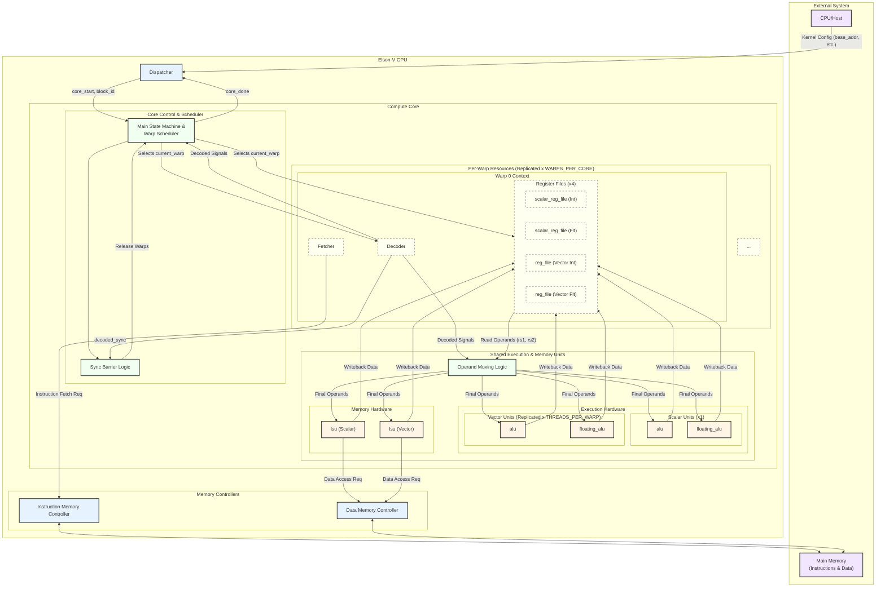

```mermaid
%% Elson-V GPU Full Hierarchical Diagram

graph TD
    %% Define Styles for different component types for clarity
    classDef gpu fill:#e6f3ff,stroke:#333,stroke-width:2px;
    classDef core fill:#f0fff0,stroke:#333,stroke-width:2px;
    classDef warpctx fill:#fffff0,stroke:#555,stroke-width:1px,stroke-dasharray: 5 5;
    classDef exec fill:#fff5e6,stroke:#333,stroke-width:2px;
    classDef external fill:#f2e6ff,stroke:#333,stroke-width:2px;
    classDef mem fill:#fff0f5,stroke:#333,stroke-width:2px;

    %% Outermost System
    subgraph External System
        direction TB
        CPU[CPU/Host]
        %% CORRECTED: Added double quotes around the label text
        DRAM["Main Memory <br/>(Instructions & Data)"]
    end
    
    %% GPU Top Level
    subgraph "Elson-V GPU"
        direction TB
        
        %% GPU-level Controllers
        Dispatcher[Dispatcher];
        subgraph Memory Controllers
            IMemCtrl[Instruction Memory Controller];
            DMemCtrl[Data Memory Controller];
        end

        %% Compute Core
        subgraph "Compute Core"
            direction TB

            %% Core's Internal Control
            subgraph Core Control & Scheduler
                direction TB
                %% CORRECTED: Added double quotes for the '&' character
                FSM["Main State Machine &<br/>Warp Scheduler"] --> Barrier[Sync Barrier Logic];
            end
            
            %% Replicated Per-Warp Resources
            subgraph "Per-Warp Resources (Replicated x WARPS_PER_CORE)"
                direction LR
                subgraph Warp 0 Context
                    direction TB
                    F0[Fetcher];
                    D0[Decoder];
                    subgraph RegFiles0["Register Files (x4)"]
                      %% CORRECTED: Added double quotes for all labels with parentheses
                      SRF_Int0["scalar_reg_file (Int)"];
                      SRF_Flt0["scalar_reg_file (Flt)"];
                      VRF_Int0["reg_file (Vector Int)"];
                      VRF_Flt0["reg_file (Vector Flt)"];
                    end
                end
                WarpN[...];
            end

            %% Shared Execution Units
            subgraph "Shared Execution & Memory Units"
                direction TB
                OpMux[Operand Muxing Logic];
                
                subgraph "Execution Hardware"
                    direction LR
                    subgraph "Scalar Units (x1)"
                      ALU_S[alu];
                      FPU_S[floating_alu];
                    end
                    subgraph "Vector Units (Replicated x THREADS_PER_WARP)"
                      ALU_V[alu];
                      FPU_V[floating_alu];
                    end
                end

                subgraph "Memory Hardware"
                    direction LR
                      %% CORRECTED: Added double quotes
                      LSU_S["lsu (Scalar)"];
                      LSU_V["lsu (Vector)"];
                    end
            end
        end
    end

    %% Define Top-Level Connections
    CPU -- "Kernel Config (base_addr, etc.)" --> Dispatcher;
    Dispatcher -- "core_start, block_id" --> FSM;
    FSM -- "core_done" --> Dispatcher;
    
    IMemCtrl <--> DRAM;
    DMemCtrl <--> DRAM;
    
    %% Connections from Core to GPU controllers
    F0 -- "Instruction Fetch Req" --> IMemCtrl;
    LSU_S -- "Data Access Req" --> DMemCtrl;
    LSU_V -- "Data Access Req" --> DMemCtrl;

    %% Internal Compute Core Connections
    FSM -- "Selects current_warp" --> D0;
    FSM -- "Selects current_warp" --> RegFiles0;
    
    D0 -- "Decoded Signals" --> FSM;
    D0 -- "Decoded Signals" --> OpMux;
    D0 -- "decoded_sync" --> Barrier;
    Barrier -- "Release Warps" --> FSM;

    RegFiles0 -- "Read Operands (rs1, rs2)" --> OpMux;
    OpMux -- "Final Operands" --> ALU_S;
    OpMux -- "Final Operands" --> FPU_S;
    OpMux -- "Final Operands" --> ALU_V;
    OpMux -- "Final Operands" --> FPU_V;
    OpMux -- "Final Operands" --> LSU_S;
    OpMux -- "Final Operands" --> LSU_V;
    
    ALU_S -- "Writeback Data" --> RegFiles0;
    FPU_S -- "Writeback Data" --> RegFiles0;
    ALU_V -- "Writeback Data" --> RegFiles0;
    FPU_V -- "Writeback Data" --> RegFiles0;
    LSU_S -- "Writeback Data" --> RegFiles0;
    LSU_V -- "Writeback Data" --> RegFiles0;
    
    %% Apply Styles
    class Dispatcher,IMemCtrl,DMemCtrl gpu;
    class FSM,Barrier,OpMux core;
    class F0,D0,RegFiles0,SRF_Int0,SRF_Flt0,VRF_Int0,VRF_Flt0,WarpN warpctx;
    class ALU_S,FPU_S,ALU_V,FPU_V,LSU_S,LSU_V exec;
    class CPU,DRAM external;
```